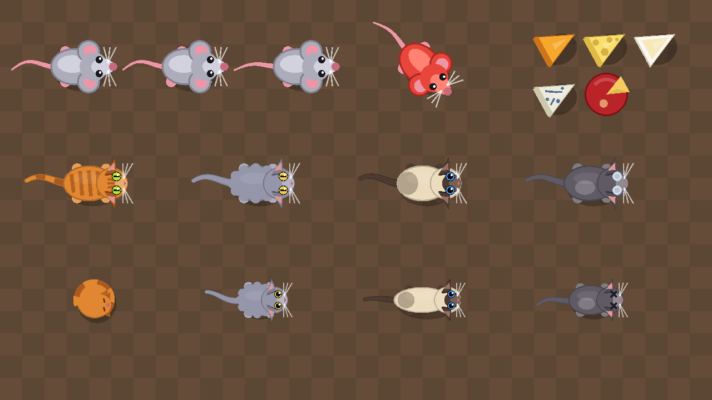
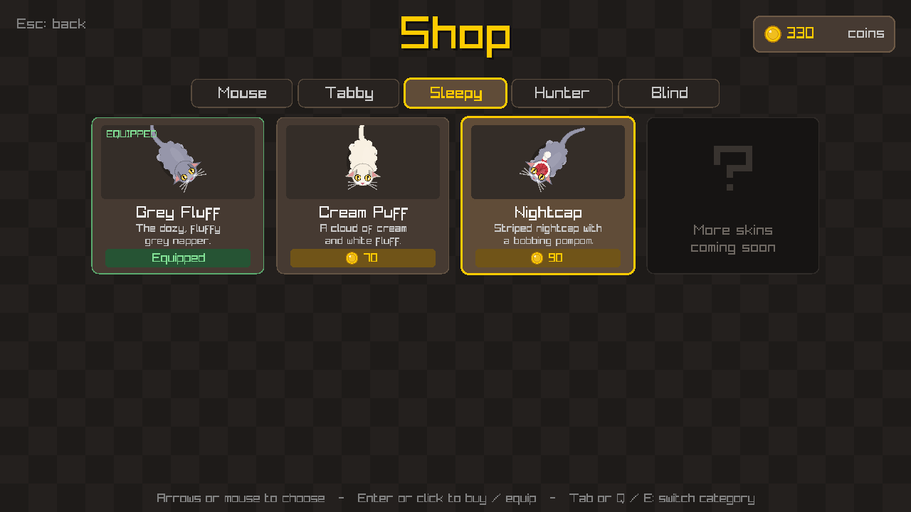
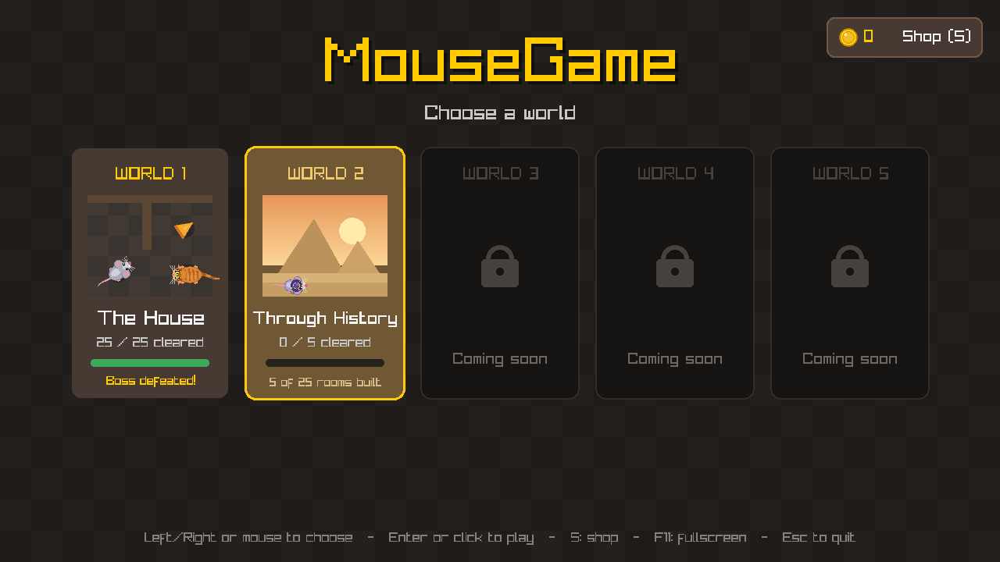
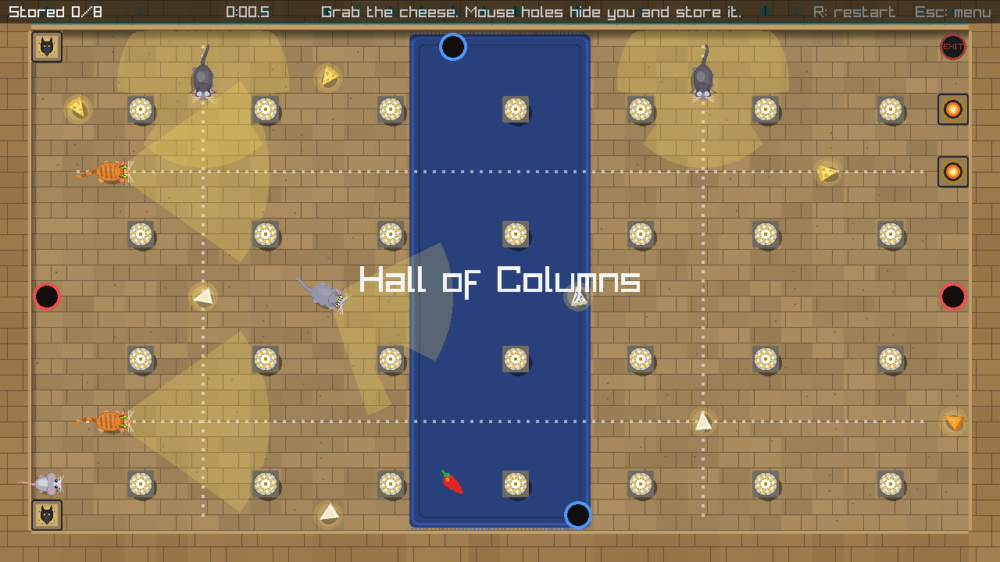
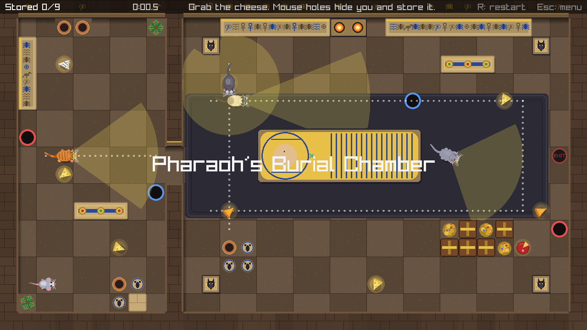
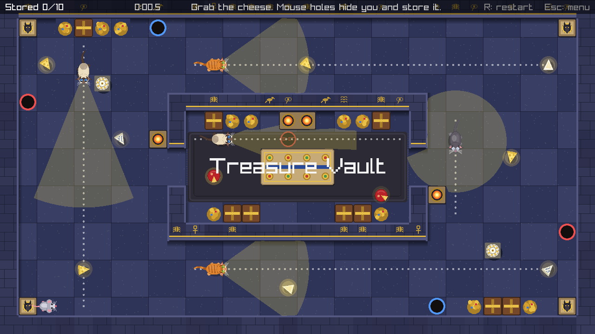

# MouseGame (working title)

A top-down stealth game written in C++20 with [raylib](https://www.raylib.com/).
Sneak a mouse past patrolling cats, carry the cheese home, and reach the exit without getting pounced on.













## Features

- **World 1: The House**: 25 levels, each a different room of a big house (foyer, living room, dining room, kitchen,
  pantry, library, billiards room, study, music room, conservatory, laundry, bathroom, bedrooms, nursery, game room,
  home theater, wine cellar, garage, basement, attic, ballroom, portrait gallery and the grand parlor)
- **Themed rooms**: each room has its own floor (wood planks, checkered tile, carpet, marble, concrete), walls, rugs
  and furniture: bookshelves, counters, stoves and fridges, pool tables, sofas, beds, a grand piano, cars and more.
  Furniture blocks movement and sight like walls do, and a cat that lunges into it gets stunned
- **Intro, world select and level select**: 5 world slots (World 1 playable, the rest "coming soon") and a
  25-level grid, with saved best times. Beat a level to unlock the next one
- **Four cat types** with different speed and senses:
  - **Tabby**: the standard patrol guard
  - **Sleepy**: slow and short-sighted, naps on a cycle; sneak past while it snoozes
  - **Hunter**: fast, long narrow vision cone
  - **Blind**: senses in a full circle around it, but only up close
- **Secret boss**: clear all 25 levels and a `?` door on the level select opens to **Sir Pounce's Throne Room**.
  Sir Pounce is a huge tuxedo cat with a crown who pounces from far away. A red lane shows where he will leap, and
  it locks in a moment before he does. Trick him into crashing into a pillar or table **3 times** to knock him out,
  grab the **Golden Cheese** he drops, and escape through the exit. Beating him unlocks World 2
- **World 2: Through History** (first 5 of 25 rooms built): the Egypt wing. Pyramid Entrance, The Grand Gallery, Hall of Columns,
  Pharaoh's Burial Chamber and the Treasure Vault, with sandstone and basalt floors, carved hieroglyph walls, columns,
  jackal statues and sphinxes, sarcophagi, braziers, reflecting pools and treasure. It has its own save file
- **Shop and coins**: cheese you bring home earns coins (Gouda is worth 2, the Golden Cheese 25), plus a bonus the
  first time you clear a level (10, or 50 for the boss). Spend them in the shop (press **S** on the world select),
  which has a tab for the mouse and one for each cat type
- **Skins**: seven mouse skins (Classic, Ace Aviator, Buccaneer, Chef Mouse, Wee Wizard, Shadow Ninja, Golden Mouse)
  and three looks per cat type (a free default plus a recolor and a costume: Midnight and Dapper Tabby, Cream Puff and
  Nightcap Sleepy cats, Chocolate Point and Ninja Hunters, Snowy and Cool Shades Blind cats). A cat skin dresses every
  cat of that type. Coins, owned skins and what you're wearing are saved in `profile.txt`
- **Fullscreen**: press **F11** (or Alt+Enter). The game keeps its 16:9 layout and scales to any window size
  with black bars; the window is also resizable
- **Lunges**: a cat that gets close crouches for a split second, then pounces. A hit catches you. A miss means it
  keeps chasing if it can still see you, or gives up and searches. Pouncing into a wall leaves it dazed with spinning
  stars, unable to see or move
- **Vision cones blocked by walls**, built by raycasting through the tile grid
- **Cat AI**: a finite-state machine (patrol, investigate, search, return, wind-up, lunge, stunned) with
  **A\* pathfinding** to the mouse's last known position
- **Detailed code-drawn characters**: the mouse (walking feet, swaying tail, whiskers) and four cat breeds, each with
  its own coat (striped tabby, fluffy sleepy cat, Siamese hunter with dark points, cloudy-eyed blind cat), animated
  paws and tail, slit pupils that go wide when chasing, and poses for sleeping, crouching, pouncing and being dazed
- **Five cheeses**: Cheddar, Swiss, Brie and Blue wedges, plus the heavy **Gouda wheel**, which slows you down twice
  as much as a normal piece
- **Cheese trail**: picked-up cheese follows behind the mouse and slows it down (7% per unit of weight, down to 55%)
- **Color-coded mouse holes**: hide from cats, store your cheese, and travel to the matching hole
- **Red peppers**: a 5-second, +50% speed boost. The mouse flashes red, and the flashing slows down as the boost
  runs out
- **Dotted patrol paths** show where each cat walks
- **Data-driven levels**: plain text files, no recompiling to add or edit a level

## Build (Windows, MSYS2 UCRT64)

Requirements: `gcc`, `gdb`, `cmake`, `ninja` (from MSYS2 UCRT64) and Git.

```bash
cmake --preset debug
cmake --build --preset debug
./build/debug/MouseGame.exe
```

In VS Code (C/C++ + CMake Tools extensions): open the folder, choose the **debug** preset, then press **F5**.
raylib is downloaded automatically by CMake on the first configure.

## Controls

| Key | Action |
|-----|--------|
| WASD / Arrows | Move (and navigate menus) |
| Space | Skip intro / in a mouse hole: travel to the matching hole |
| Enter or click | Choose a world or level / next level after winning / buy or equip in the shop |
| S | Open the shop (on the world select) |
| Tab or Q / E | Shop: switch category |
| F11 or Alt+Enter | Toggle fullscreen |
| R | Restart level |
| Esc | Back (level -> level select -> world select -> quit) |
| F1 | Debug view: A* paths, lunge range, last known position |

## Getting caught

Cats that see you chase you, but you're only caught if one **touches** you, usually with a lunge. A lunge starts
when a cat that can see you is within 110 px: it crouches for 0.25 s (your warning, marked with a red "!!"), then
dashes up to 150 px in a straight line. Dodge sideways or put a wall between you. A cat that pounces into a wall is
stunned for 1.8 s, and dazed cats are harmless to touch.

## Cheese and mouse holes

Picking up cheese doesn't bank it: it trails behind you and slows you down. Walk into any mouse hole to store it,
and while you're in a hole the cats can't see or catch you. Press Space to pop out of the matching hole, or let go
and press a direction to leave. The exit only works once every piece of cheese has been picked up.

## How the cats work

Each cat runs a state machine:

1. **Patrol**: walk the route, pausing and turning at each waypoint (sleepy cats also nap here).
2. **Investigate**: on spotting the mouse, chase it along an A* path to its last known position.
3. **Wind-up / Lunge**: if the mouse is close and in sight, crouch, then pounce.
4. **Stunned**: after pouncing into a wall, dazed for a moment.
5. **Search**: sweep its gaze around the last known position for a few seconds.
6. **Return**: path back to the patrol route and resume.

A cat senses the mouse if it's within range, inside its cone (blind cats: any direction), and a ray from the cat to
the mouse doesn't hit a wall. Cat stats live in one table in `src/CatTypes.cpp`; lunge timings are in `src/Cat.h`.

**Sir Pounce** (`cat boss`) uses the same machine with a bigger body, a longer lunge and a wind-up that visibly
locks its aim (`BossAimLock` in `src/Cat.h`). Each wall crash is one hit, and after `BossHitsToWin` (3) he goes to
the `KnockedOut` state for good. Every hit makes him chase faster and crouch for less time.

## Level format

Levels live in `assets/levels/level1.txt`, `level2.txt`, and so on. The game loads them in order until a number is
missing. The secret boss level is `assets/levels/boss1.txt` (it only appears once all 25 are loaded). One character per 40x40 tile:

| Char | Meaning |
|------|---------|
| `#` | Wall |
| `.` | Floor |
| `P` | Player start |
| `C` | Cheese (Cheddar, Swiss, Brie or Blue, picked from its position) |
| `O` | Gouda wheel: heavy, counts double for slowdown |
| `E` | Exit (usable once every piece of cheese has been picked up) |
| `1`-`4` | Mouse hole; two holes with the same digit are a linked pair (red, blue, purple, teal) |
| `R` | Red pepper (speed boost) |

Furniture letters (all solid): `B` shelf, `T` table, `K` counter/cabinet, `A` appliance, `S` sofa/seats, `D` bed,
`G` pool table, `U` tub/fountain, `L` plant/planter, `X` boxes/barrels, `Q` piano, `F` fireplace, `W` wardrobe, `Y` car.
Rectangles of the same letter are drawn as one piece, and the art adapts to the room: a `B` shelf holds books in the
library, jars in the pantry and wine bottles in the cellar.

World 2 adds `N` column, `M` statue (a jackal guardian on its own, a sphinx when it is 2+ tiles) and `V` treasure, and
re-skins the house letters in its Egypt rooms: `B` stele, `T` altar, `D` sarcophagus, `L` palm, `X` urns and blocks,
`F` brazier, `U` reflecting pool, `S` stone bench. Its rooms are `assets/levels/w2_level1.txt`, `w2_level2.txt`, and so on.
Room themes for `room <name>`: `pyramid`, `greatgallery`, `columnhall`, `tomb`, `vault`. Rug colors also include
`lapis`, `sand` and `onyx`.

After the grid, leave a blank line, then:

```
name The Kitchen
room kitchen
rug 22,10 7,6 blue
cat tabby 9,5 21,5
cat hunter 9,11 21,11
cat sleepy 24,7
```

`name` sets the title shown on the level select. `room` picks the theme (`foyer`, `living`, `dining`, `hallway`,
`kitchen`, `pantry`, `library`, `billiards`, `study`, `music`, `conservatory`, `laundry`, `bathroom`, `bedroom`,
`nursery`, `gameroom`, `theater`, `cellar`, `garage`, `basement`, `attic`, `ballroom`, `gallery`, `parlor`).
`rug x,y w,h color` adds a walkable rug (`red`, `blue`, `green`, `gold`, `purple`, `teal`, `cream`). Each `cat` line (`tabby`, `sleepy`, `hunter`, `blind` or `boss`) gives a type and patrol waypoints in tile
coordinates. The cat walks them forward, then back. Consecutive waypoints need a clear straight path (the game logs
a warning otherwise). A cat with one waypoint stays put: sleepy cats nap there, others slowly turn in place.

All 25 levels were checked with an automated solver that runs the real cat code, models the cheese slowdown and
mouse holes, and confirms each level can be beaten without ever being seen. The boss fight was checked with a bot
that plays with real key presses: it wins without being caught, even when it reacts 0.3 s late, and a player who never
dodges gets caught.

## Code layout

- `src/main.cpp`: window setup and main loop
- `src/Viewport.*`: fixed 1280x720 logical screen scaled to any window size, mouse mapping, F11 fullscreen
- `src/App.*`: intro, world select, level select, shop, screen flow, saving best times
- `src/Game.*`: one level in play: cheese carrying/storing, mouse holes, catching, timer, win/lose, HUD
- `src/Level.*`: loads the tile grid, furniture, rugs and room theme; raycasting / line of sight / wall overlap
- `src/RoomRenderer.*`: draws each room (floors, rugs, walls, shadows, furniture art) once into a cached texture
- `src/RoomTheme.*`: floor style and color palette for each room type
- `src/Player.*`: movement and circle-vs-tile collision
- `src/Sprites.*`: code-drawn mouse, cat and cheese art (shared by the game and the menus)
- `src/Cheese.*`: cheese kinds, their weights and coin values
- `src/Skins.*`: the skin catalog (categories, names, descriptions, prices)
- `src/Profile.*`: coins, owned skins and the skin worn in each category, saved to `profile.txt`
- `src/CheeseTrail.*`: position history that carried cheese follows
- `src/Cat.*`: cat behavior state machine, lunging, stuns, napping, vision drawing
- `src/CatTypes.*`: stats for each cat type
- `src/Pathfinding.*`: A* over the tile grid with path smoothing

## Roadmap

- [x] Movement, tile levels, wall collision, cheese, exit
- [x] Patrolling cats with wall-blocked vision cones
- [x] A* pathfinding and investigate/search/return AI
- [x] Four cat types, lunges with wall stuns
- [x] Mouse holes (hide + teleport), cheese trail with slowdown and storing, dotted patrol paths
- [x] Intro, world select, 25-slot level select, 10 levels, sequential unlocking
- [x] Red pepper speed boost
- [x] World 1 secret boss (Sir Pounce) that unlocks World 2
- [x] Shop with coins, mouse skins and cat skins (a tab for each)
- [x] Fullscreen (F11)
- [ ] Lives and respawning at the last mouse hole
- [x] Detailed character art and five cheese types
- [ ] Sound effects and music
- [x] World 1: 25 themed house rooms with furniture
- [x] World 2: first 5 rooms (Egypt wing)
- [ ] World 2: the other 20 rooms (Greece and Rome, medieval castle, Asia with the Taj Mahal, Versailles, a futuristic lab)
- [ ] Worlds 3-5
