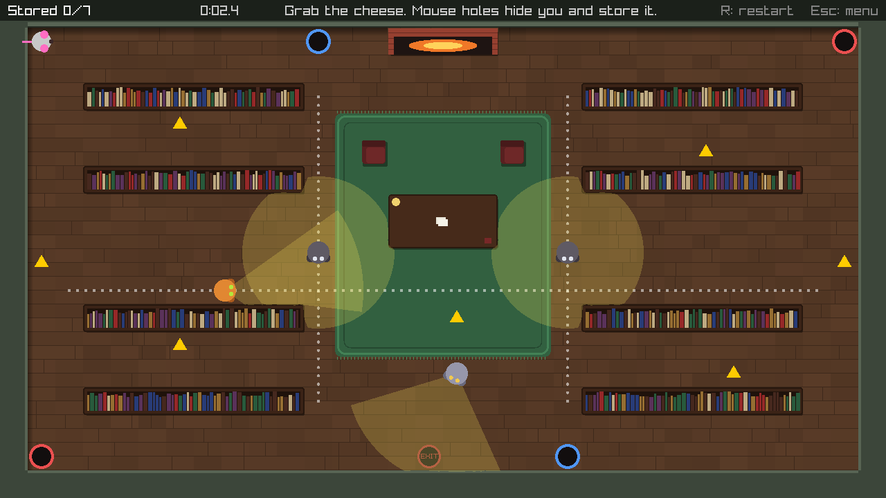
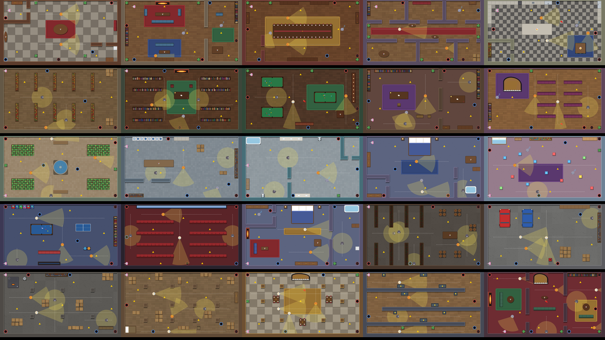
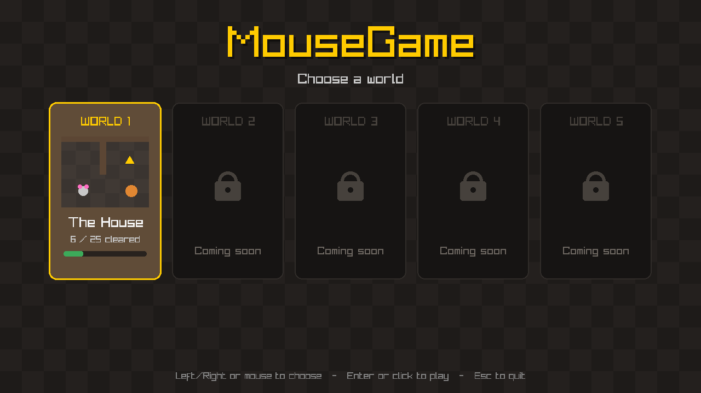
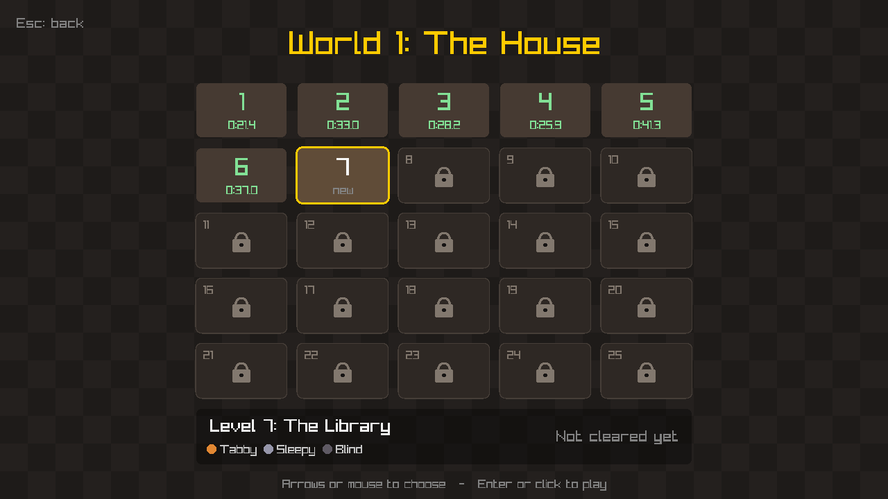

# MouseGame (working title)

A top-down stealth game written in C++20 with [raylib](https://www.raylib.com/).
Sneak a mouse past patrolling cats, carry the cheese home, and reach the exit without getting pounced on.






## Features

- **World 1: The House**: 25 levels, each a different room of a big house (foyer, living room, dining room, kitchen,
  pantry, library, billiards room, study, music room, conservatory, laundry, bathroom, bedrooms, nursery, game room,
  home theater, wine cellar, garage, basement, attic, ballroom, portrait gallery and the grand parlor)
- **Themed rooms**: each room has its own floor (wood planks, checkered tile, carpet, marble, concrete), walls, rugs
  and furniture: bookshelves, counters, stoves and fridges, pool tables, sofas, beds, a grand piano, cars and more.
  Furniture blocks movement and sight like walls do, and a cat that lunges into it gets stunned
- **Intro, world select and level select**: 5 world slots (World 1 playable, the rest "coming soon") and a
  25-level grid, with saved best times. Beat a level to unlock the next one
- **Four cat types** with different speed and senses:
  - **Tabby**: the standard patrol guard
  - **Sleepy**: slow and short-sighted, naps on a cycle; sneak past while it snoozes
  - **Hunter**: fast, long narrow vision cone
  - **Blind**: senses in a full circle around it, but only up close
- **Lunges**: a cat that gets close crouches for a split second, then pounces. A hit catches you. A miss means it
  keeps chasing if it can still see you, or gives up and searches. Pouncing into a wall leaves it dazed with spinning
  stars, unable to see or move
- **Vision cones blocked by walls**, built by raycasting through the tile grid
- **Cat AI**: a finite-state machine (patrol, investigate, search, return, wind-up, lunge, stunned) with
  **A\* pathfinding** to the mouse's last known position
- **Cheese trail**: picked-up cheese follows behind the mouse and slows it down (7% each, down to 55% speed)
- **Color-coded mouse holes**: hide from cats, store your cheese, and travel to the matching hole
- **Red peppers**: a 5-second, +50% speed boost. The mouse flashes red, and the flashing slows down as the boost
  runs out
- **Dotted patrol paths** show where each cat walks
- **Data-driven levels**: plain text files, no recompiling to add or edit a level

## Build (Windows, MSYS2 UCRT64)

Requirements: `gcc`, `gdb`, `cmake`, `ninja` (from MSYS2 UCRT64) and Git.

```bash
cmake --preset debug
cmake --build --preset debug
./build/debug/MouseGame.exe
```

In VS Code (C/C++ + CMake Tools extensions): open the folder, choose the **debug** preset, then press **F5**.
raylib is downloaded automatically by CMake on the first configure.

## Controls

| Key | Action |
|-----|--------|
| WASD / Arrows | Move (and navigate menus) |
| Space | Skip intro / in a mouse hole: travel to the matching hole |
| Enter or click | Choose a world or level / next level after winning |
| R | Restart level |
| Esc | Back (level -> level select -> world select -> quit) |
| F1 | Debug view: A* paths, lunge range, last known position |

## Getting caught

Cats that see you chase you, but you're only caught if one **touches** you, usually with a lunge. A lunge starts
when a cat that can see you is within 110 px: it crouches for 0.25 s (your warning, marked with a red "!!"), then
dashes up to 150 px in a straight line. Dodge sideways or put a wall between you. A cat that pounces into a wall is
stunned for 1.8 s, and dazed cats are harmless to touch.

## Cheese and mouse holes

Picking up cheese doesn't bank it: it trails behind you and slows you down. Walk into any mouse hole to store it,
and while you're in a hole the cats can't see or catch you. Press Space to pop out of the matching hole, or let go
and press a direction to leave. The exit only works once every piece of cheese has been picked up.

## How the cats work

Each cat runs a state machine:

1. **Patrol**: walk the route, pausing and turning at each waypoint (sleepy cats also nap here).
2. **Investigate**: on spotting the mouse, chase it along an A* path to its last known position.
3. **Wind-up / Lunge**: if the mouse is close and in sight, crouch, then pounce.
4. **Stunned**: after pouncing into a wall, dazed for a moment.
5. **Search**: sweep its gaze around the last known position for a few seconds.
6. **Return**: path back to the patrol route and resume.

A cat senses the mouse if it's within range, inside its cone (blind cats: any direction), and a ray from the cat to
the mouse doesn't hit a wall. Cat stats live in one table in `src/CatTypes.cpp`; lunge timings are in `src/Cat.h`.

## Level format

Levels live in `assets/levels/level1.txt`, `level2.txt`, and so on. The game loads them in order until a number is
missing. One character per 40x40 tile:

| Char | Meaning |
|------|---------|
| `#` | Wall |
| `.` | Floor |
| `P` | Player start |
| `C` | Cheese |
| `E` | Exit (usable once every piece of cheese has been picked up) |
| `1`-`4` | Mouse hole; two holes with the same digit are a linked pair (red, blue, purple, teal) |
| `R` | Red pepper (speed boost) |

Furniture letters (all solid): `B` shelf, `T` table, `K` counter/cabinet, `A` appliance, `S` sofa/seats, `D` bed,
`G` pool table, `U` tub/fountain, `L` plant/planter, `X` boxes/barrels, `Q` piano, `F` fireplace, `W` wardrobe, `Y` car.
Rectangles of the same letter are drawn as one piece, and the art adapts to the room: a `B` shelf holds books in the
library, jars in the pantry and wine bottles in the cellar.

After the grid, leave a blank line, then:

```
name The Kitchen
room kitchen
rug 22,10 7,6 blue
cat tabby 9,5 21,5
cat hunter 9,11 21,11
cat sleepy 24,7
```

`name` sets the title shown on the level select. `room` picks the theme (`foyer`, `living`, `dining`, `hallway`,
`kitchen`, `pantry`, `library`, `billiards`, `study`, `music`, `conservatory`, `laundry`, `bathroom`, `bedroom`,
`nursery`, `gameroom`, `theater`, `cellar`, `garage`, `basement`, `attic`, `ballroom`, `gallery`, `parlor`).
`rug x,y w,h color` adds a walkable rug (`red`, `blue`, `green`, `gold`, `purple`, `teal`, `cream`). Each `cat` line gives a type and patrol waypoints in tile
coordinates. The cat walks them forward, then back. Consecutive waypoints need a clear straight path (the game logs
a warning otherwise). A cat with one waypoint stays put: sleepy cats nap there, others slowly turn in place.

All 25 levels were checked with an automated solver that runs the real cat code, models the cheese slowdown and
mouse holes, and confirms each level can be beaten without ever being seen.

## Code layout

- `src/main.cpp`: window setup and main loop
- `src/App.*`: intro, world select, level select, screen flow, saving best times
- `src/Game.*`: one level in play: cheese carrying/storing, mouse holes, catching, timer, win/lose, HUD
- `src/Level.*`: loads the tile grid, furniture, rugs and room theme; raycasting / line of sight / wall overlap
- `src/RoomRenderer.*`: draws each room (floors, rugs, walls, shadows, furniture art) once into a cached texture
- `src/RoomTheme.*`: floor style and color palette for each room type
- `src/Player.*`: movement and circle-vs-tile collision
- `src/CheeseTrail.*`: position history that carried cheese follows
- `src/Cat.*`: cat behavior state machine, lunging, stuns, napping, vision drawing
- `src/CatTypes.*`: stats for each cat type
- `src/Pathfinding.*`: A* over the tile grid with path smoothing

## Roadmap

- [x] Movement, tile levels, wall collision, cheese, exit
- [x] Patrolling cats with wall-blocked vision cones
- [x] A* pathfinding and investigate/search/return AI
- [x] Four cat types, lunges with wall stuns
- [x] Mouse holes (hide + teleport), cheese trail with slowdown and storing, dotted patrol paths
- [x] Intro, world select, 25-slot level select, 10 levels, sequential unlocking
- [x] Red pepper speed boost
- [ ] Lives and respawning at the last mouse hole
- [ ] Sprites and sound effects
- [x] World 1: 25 themed house rooms with furniture
- [ ] Worlds 2-5
