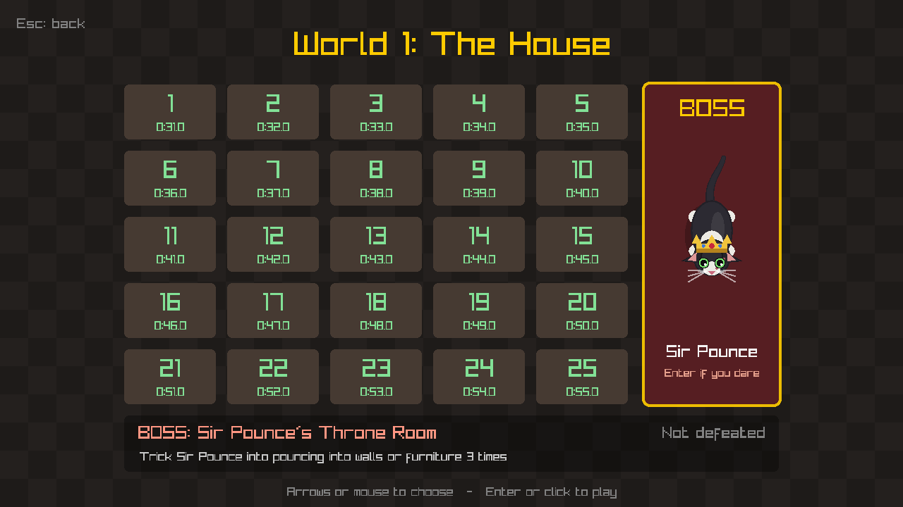
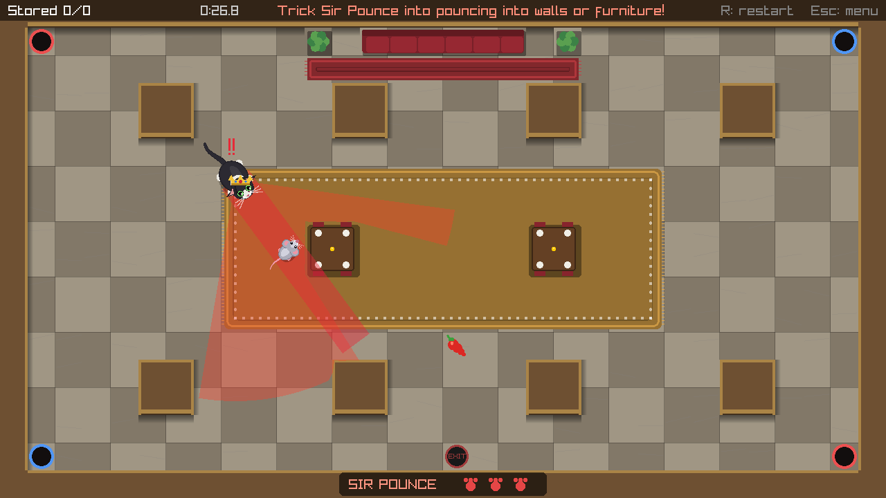
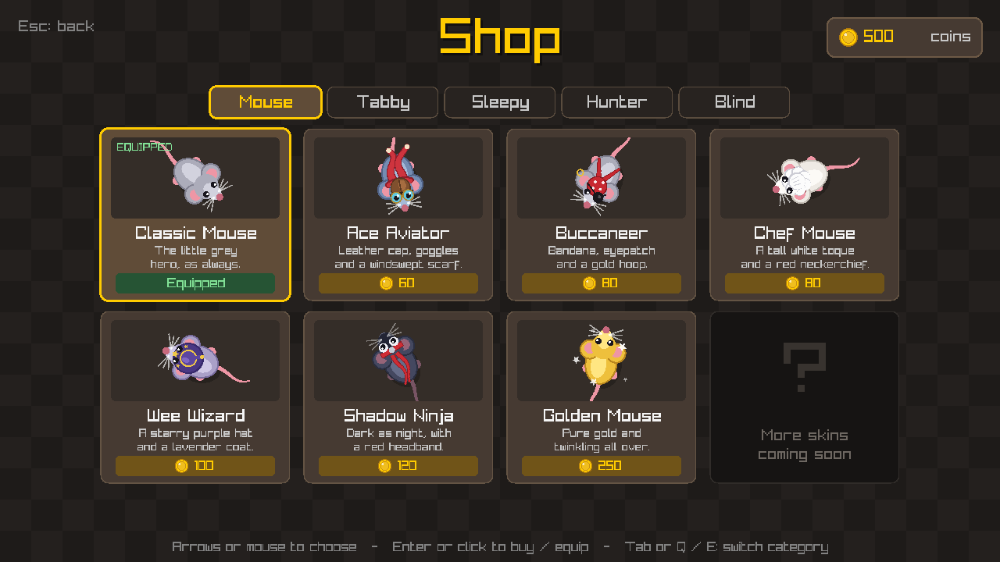
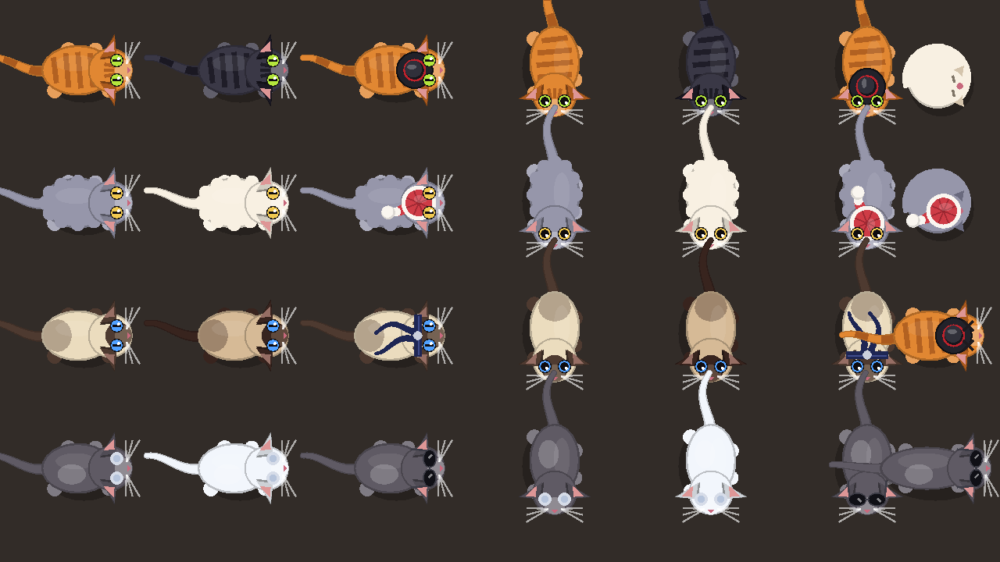
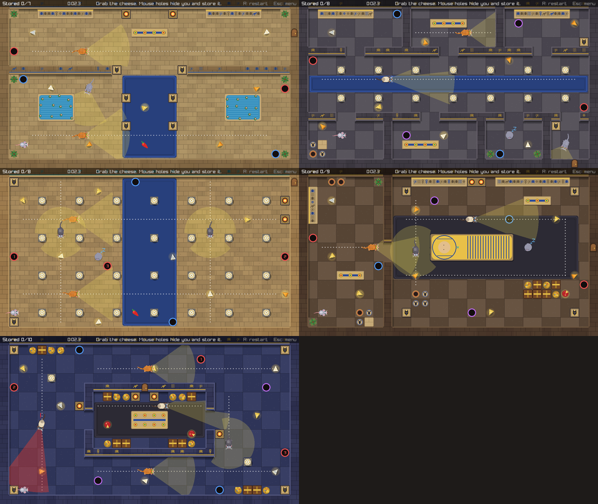
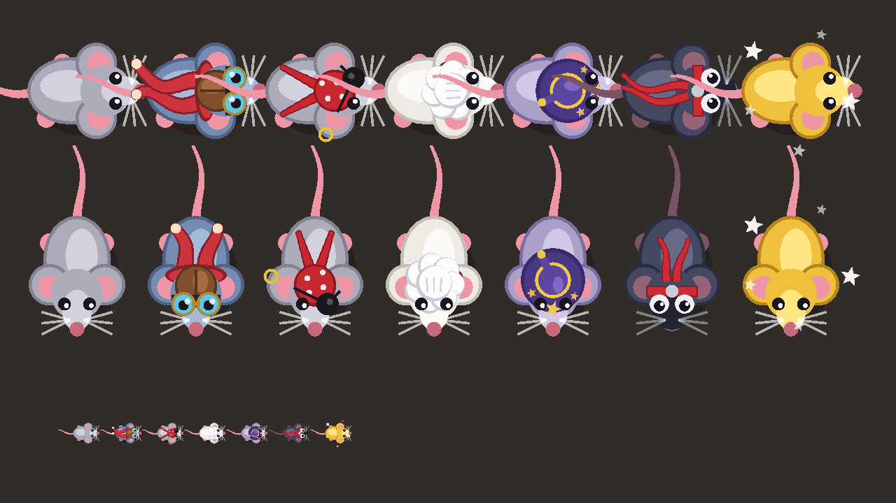

# Sneak

A 2D stealth game written in C++20 with [Raylib](https://www.raylib.com/). You play a small, quiet mouse sneaking through 30 levels and a secret boss fight, slipping past enemies (cats) that are watching for you.

Sneak is an independent, non-commercial personal project. It was inspired by the gameplay of a mobile stealth game I enjoyed as a kid, but it is not affiliated with that game or its creators and uses none of its original art, audio, characters, or branding.


## Features

- **30 playable levels** in two worlds: 25 themed rooms of a house, and the first 5 rooms of an Egyptian pyramid
- **A secret boss fight** against Sir Pounce, a giant crowned cat, that unlocks World 2
- **Enemy detection:** cats notice the player by line of sight. Each cat has a vision cone and a range, and the cone is raycast through the tile grid, so walls and furniture block it
- **Four cat types** (tabby, sleepy, hunter and blind) with different speeds and senses, driven by a state machine with A\* pathfinding
- **Player movement and collision** with walls and furniture
- **Cheese, mouse holes and peppers:** carried cheese slows you down, holes hide you and bank your haul, and red peppers give a speed boost
- **Level progression:** complete a level to unlock the next, with best times saved
- **A shop** where cheese coins buy mouse and cat skins
- **Fullscreen support** (F11) with a resizable window
- **All art drawn in code:** there are no image assets, and levels are plain text files

## Screenshots

| | |
|---|---|
|  |  |
| World select, with World 2 unlocked | Level select with best times and the secret boss slot |
|  |  |
| The boss slot appears once all 25 levels are cleared | Sir Pounce's Throne Room |
|  |  |
| The shop, with a tab for the mouse and each cat type | Cat skins: a recolor and a costume for every type |

All 25 rooms of World 1:


The first five rooms of World 2 (Pyramid Entrance, The Grand Gallery, Hall of Columns, Pharaoh's Burial Chamber and
the Treasure Vault):



## Controls

| Key | Action |
|-----|--------|
| WASD / Arrow keys | Move (and navigate menus) |
| Enter or click | Choose a world or level, go to the next level after winning, buy or equip in the shop |
| Space | Skip the intro. Inside a mouse hole: pop out of the linked hole |
| S | Open the shop (on the world select) |
| Tab or Q / E | Switch shop category |
| F11 or Alt+Enter | Toggle fullscreen |
| R | Restart the level |
| Esc | Back (level -> level select -> world select -> quit) |
| F1 | Debug view: A\* paths, lunge range and last known positions |

## How to play

Reach the exit without being caught. The exit only opens once **every piece of cheese** in the room has been collected.

**Cheese.** Picked-up cheese trails behind you and slows you down (7% per unit of weight, down to 55% of full
speed). The five kinds are Cheddar, Swiss, Brie, Blue and the heavy **Gouda wheel**, which weighs double.

**Mouse holes.** Walk into any hole to hide: cats cannot see or catch you, and your carried cheese is stored. Holes
come in color-coded linked pairs. Press Space while hiding to pop out of the matching hole, or press a direction to
leave the way you came.

**Red peppers.** A 5-second, +50% speed boost. You flash red, and the flashing slows down as it runs out.

**Getting caught.** A cat that sees you chases you, but you are only caught if it **touches** you. When a cat that
can see you gets within 110 px it crouches for a quarter of a second (your warning, marked with a red "!!") and then
dashes up to 150 px in a straight line. Dodge sideways or put something solid between you. A cat that pounces into
a wall or piece of furniture is dazed for 1.8 seconds and cannot see or move.

## Requirements

- Windows with [MSYS2](https://www.msys2.org/) (UCRT64 environment) providing `gcc`, `cmake` and `ninja`
- [Git](https://git-scm.com/)
- An internet connection on the first configure, because CMake downloads raylib 5.5 automatically

The provided CMake presets expect MSYS2 in `C:/msys64`. If it lives elsewhere, edit the compiler paths in
`CMakePresets.json`. The code itself is portable C++20 and raylib supports other platforms, but only the Windows /
MinGW setup is configured here.

## Build and run

```bash
git clone https://github.com/LucasB131/MouseGame.git
cd MouseGame
cmake --preset release
cmake --build --preset release
./build/release/MouseGame.exe
```

Use `debug` instead of `release` for a debug build (`./build/debug/MouseGame.exe`). The build copies `assets/` next
to the executable and links the MinGW runtime statically, so the `.exe` runs on its own.

In VS Code, install the *C/C++* and *CMake Tools* extensions, open the folder, choose the **debug** preset and press
**F5**.

## Save data

Progress is stored in plain text files next to the executable: `save_world1.txt` and `save_world2.txt` (best time per
level) and `profile.txt` (coins, owned skins and what you are wearing). Delete them to start over.

## Worlds and levels

**World 1: The House** has 25 levels, one per room: foyer, living room, dining room, grand hallway, kitchen, pantry,
library, billiards room, study, music room, conservatory, laundry, bathroom, bedrooms, nursery, game room, home
theater, wine cellar, garage, basement, attic, ballroom, portrait gallery and the grand parlor. Each room has its own
floor, walls, rugs and furniture art, and each level unlocks when you beat the one before.

**The secret boss.** Clear all 25 levels and a `?` door opens on the level select to **Sir Pounce's Throne Room**.
Sir Pounce is a huge tuxedo cat in a crown who pounces from across the room. A red lane shows where he will leap and
locks in a moment before he does. Trick him into crashing into a pillar or table **three times** to knock him out,
grab the **Golden Cheese** he drops, and escape. Each hit makes him chase faster and crouch for less time. Beating
him unlocks World 2.

**World 2: Through History** is a series of rooms through the ages. The first five form an Egypt wing, with sandstone
and basalt floors, hieroglyph-carved walls, columns, jackal statues, sphinxes, sarcophagi, braziers, reflecting
pools and treasure. World 2 keeps its own save file and shows how many of its 25 slots are built.

Worlds 3-5 appear on the world select as locked placeholders.

## Cats and the cat AI

| Cat | Behavior |
|-----|----------|
| **Tabby** | The standard patrol guard: balanced speed and a medium vision cone |
| **Sleepy** | Slow and short-sighted, and naps on a cycle, so you can sneak past while it snoozes |
| **Hunter** | Fast, with a long, narrow vision cone |
| **Blind** | Senses in a full circle around itself, but only at short range |

Every cat runs the same finite-state machine:

1. **Patrol**: walk the route, pausing and turning at each waypoint (sleepy cats nap here).
2. **Investigate**: after spotting the mouse, chase it along an A\* path to its last known position.
3. **Wind-up / Lunge**: if the mouse is close and in sight, crouch, then pounce.
4. **Stunned**: dazed after pouncing into something solid.
5. **Search**: sweep its gaze around the last known position for a few seconds.
6. **Return**: path back to the patrol route and resume.

A cat senses the mouse if it is within range, inside its cone (blind cats: any direction), and a ray from the cat to
the mouse does not hit a wall or furniture. Stats for each type live in one table in `src/CatTypes.cpp`, and lunge
timings are in `src/Cat.h`.

Sir Pounce uses the same machine with a larger body, a longer lunge and a wind-up that visibly locks his aim
(`BossAimLock`). Each crash is one hit, and after `BossHitsToWin` (3) he enters the permanent `KnockedOut` state.

## Shop, coins and skins

Cheese you bring home earns coins: 1 for most cheeses, 2 for Gouda and 25 for the Golden Cheese, plus a bonus the
first time you clear a level (10 coins, or 50 for the boss). Press **S** on the world select to spend them.

- **Seven mouse skins**: Classic, Ace Aviator, Buccaneer, Chef Mouse, Wee Wizard, Shadow Ninja and Golden Mouse.
- **Three looks per cat type**: a free default, a recolor and a costume. Tabby: Midnight and Dapper. Sleepy: Cream
  Puff and Nightcap. Hunter: Chocolate Point and Ninja. Blind: Snowy and Cool Shades. A cat skin dresses every cat of
  that type in every level.



## Making your own levels

Levels are plain text files, so adding or editing one needs no recompiling. World 1 loads `assets/levels/level1.txt`,
`level2.txt`, ... in order until a number is missing, with the secret boss in `boss1.txt`. World 2 loads
`w2_level1.txt`, `w2_level2.txt`, and so on. The grid is 32x18 tiles of 40x40 px, one character per tile:

| Char | Meaning |
|------|---------|
| `#` | Wall |
| `.` | Floor |
| `P` | Player start |
| `C` | Cheese (Cheddar, Swiss, Brie or Blue, chosen from its position) |
| `O` | Gouda wheel: heavy, counts double for slowdown |
| `E` | Exit (opens once all cheese is collected) |
| `1`-`4` | Mouse hole; two holes with the same digit are a linked pair (red, blue, purple, teal) |
| `R` | Red pepper (speed boost) |

Furniture letters are solid, blocking movement and sight like walls:

| Char | Furniture | Char | Furniture |
|------|-----------|------|-----------|
| `B` | shelf | `L` | plant / planter |
| `T` | table | `X` | boxes / barrels |
| `K` | counter / cabinet | `Q` | piano |
| `A` | appliance | `F` | fireplace |
| `S` | sofa / seats | `W` | wardrobe |
| `D` | bed | `Y` | car |
| `G` | pool table | `U` | tub / fountain |
| `N` | column (World 2) | `M` | statue (World 2) |
| `V` | treasure (World 2) | | |

Adjacent tiles of the same letter are drawn as one piece, and the art adapts to the room's theme: a `B` shelf holds
books in the library, jars in the pantry, wine bottles in the cellar and a hieroglyph stele in the pyramid.

After the grid, leave a blank line and add the details:

```
name The Kitchen
room kitchen
rug 22,10 7,6 blue
cat tabby 9,5 21,5
cat hunter 9,11 21,11
cat sleepy 24,7
```

- `name`: the title on the level select.
- `room`: the theme. World 1: `foyer`, `living`, `dining`, `hallway`, `kitchen`, `pantry`, `library`, `billiards`,
  `study`, `music`, `conservatory`, `laundry`, `bathroom`, `bedroom`, `nursery`, `gameroom`, `theater`, `cellar`,
  `garage`, `basement`, `attic`, `ballroom`, `gallery`, `parlor`. World 2: `pyramid`, `greatgallery`, `columnhall`,
  `tomb`, `vault`.
- `rug x,y w,h color`: a walkable rug (`red`, `blue`, `green`, `gold`, `purple`, `teal`, `cream`, `lapis`, `sand`,
  `onyx`).
- `cat <type> x,y x,y ...`: a cat (`tabby`, `sleepy`, `hunter`, `blind` or `boss`) and its patrol waypoints in tile
  coordinates. It walks them forward, then back. Consecutive waypoints need a clear straight path, otherwise the game
  logs a warning. A cat with one waypoint stays put: sleepy cats nap there and others slowly turn in place.

## Project Structure

```
MouseGame/
├── src/              C++ source files (game loop, player, cats, levels, rendering, menus)
├── assets/levels/    Level files: level1-25.txt, boss1.txt and w2_level1-5.txt
├── docs/             Screenshots used in this README
├── CMakeLists.txt    Build configuration (raylib is downloaded automatically)
├── CMakePresets.json Debug and release presets for MinGW + Ninja
├── LICENSE
└── README.md
```

| Path | Responsibility |
|------|----------------|
| `src/main.cpp` | Window setup and main loop |
| `src/Viewport.*` | Fixed 1280x720 logical screen scaled to any window size, mouse mapping, fullscreen |
| `src/App.*` | Intro, world select, level select, shop, screen flow, per-world saves |
| `src/Game.*` | One level in play: cheese carrying and storing, mouse holes, catching, timer, HUD |
| `src/Level.*` | Tile grid, furniture, rugs and room theme loading; raycasting, line of sight, collision queries |
| `src/RoomRenderer.*` | Draws each room (floors, rugs, walls, shadows, furniture art) once into a cached texture |
| `src/RoomTheme.*` | Floor style and color palette for every room theme |
| `src/Player.*` | Movement and circle-vs-tile collision |
| `src/Cat.*`, `src/CatTypes.*` | Cat state machine, lunges, stuns and napping; stats per cat type |
| `src/Pathfinding.*` | A\* over the tile grid with path smoothing |
| `src/Sprites.*` | Code-drawn mouse, cat and cheese art, shared by the game and the menus |
| `src/Cheese.*`, `src/CheeseTrail.*` | Cheese kinds, weights and coin values; the position history carried cheese follows |
| `src/Skins.*`, `src/Profile.*` | The skin catalog; coins, owned skins and equipped skins, saved to `profile.txt` |
| `assets/levels/` | Level files |

## How It Works

- **Game loop:** a standard Raylib loop that handles input, updates game state, and draws each frame at a fixed 1280x720 logical resolution that is scaled to the window.
- **Levels:** each level is loaded from a plain text file (see [Making your own levels](#making-your-own-levels)), so adding a level does not require changing the core systems.
- **Enemies:** every frame each cat checks whether the mouse is within range, inside its vision cone, and not hidden behind a wall (a ray is cast through the tile grid). It then moves through its state machine: patrol, investigate, wind-up, lunge, stunned, search and return.
- **Collision:** the mouse is a circle tested against the solid tiles of the grid. Cats reuse the same tile queries, and a cat that lunges into a wall or furniture is stunned.
- **Rendering:** each room is drawn once into a cached texture, and only the moving parts are drawn each frame.

## Testing and level validation

All 30 regular levels were validated with an offline solver during development: it runs the real cat code, models
the cheese slowdown and mouse holes, and searches for a route that collects everything and exits without ever being
seen, using a movement schedule slower than the real mouse so a found route has some margin. The boss fight was
checked with a bot that plays through real key presses: it wins without being caught even when it reacts 0.3 seconds
late, and a player who never dodges is caught. Menus, saves, the shop and fullscreen mouse mapping were checked with
scripted input and screenshots. These test tools are not part of this repository.

## Roadmap

- [x] World 1: 25 levels and the secret boss
- [x] Shop with mouse and cat skins
- [x] Fullscreen support
- [x] World 2: the first 5 rooms (Egypt wing)
- [ ] Soundtrack and sound effects
- [ ] The remaining 20 rooms of World 2 (ancient Greece and Rome, a medieval castle, Asia, Versailles and a futuristic lab)
- [ ] Lives and respawning at the last mouse hole
- [ ] Worlds 3-5

## What I Learned

Building Sneak independently taught me how to structure a larger C++ project, manage game state across many levels, and debug problems. It also covered tile-based collision, raycast line of sight, A\* pathfinding and finite-state machines for enemy behavior.

## Credits

Game code, design, and level layouts by Lucas Brand. All characters, levels and art were created for this project and are drawn in code. There are no audio or third-party art assets.

Built with [Raylib](https://www.raylib.com/), which is distributed under the zlib/libpng license.

## License

Released under the [MIT License](LICENSE).

## Disclaimer

Sneak is a fan-inspired, non-commercial project. It is not affiliated with, endorsed by, or sponsored by the creators or publishers of any other game, and it contains no assets taken from any other game.

## Contact

Lucas Brand | [GitHub: LucasB131](https://github.com/LucasB131) | brand.180@osu.edu
